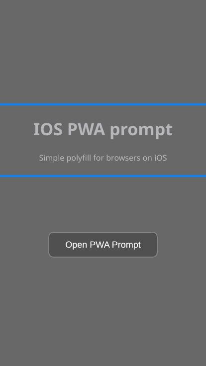

## :iphone: Native support iOS PWA Prompt for browsers

A component that delivers a prompt for Progressive Web App (PWA). The prompt informs the user about the possibility of adding the page to the device with the use of the button "Add to Home Screen"



### :loudspeaker: Description

- :hammer: customizable with Vanilla JS, Vue, Angular or React

- :unlock: the ability to develop your own logic without unnecessary code

- :high_brightness: prompt has a dark theme wrote with sass

- :large_orange_diamond: provide your website with native support


### Usage

```
git clone https://github.com/narloch-eu/ios-pwa-prompt-js.git
```

```bash
npm install
```

```bash
npm run start
```

:warning: styles are generated with node-sass dependencies

### Authors

- [Adrian Narloch](https://narloch.eu/)
- [Piotr Grobelak](https://github.com/PiotrGrobelak)

### License

[MIT](https://opensource.org/licenses/MIT)
